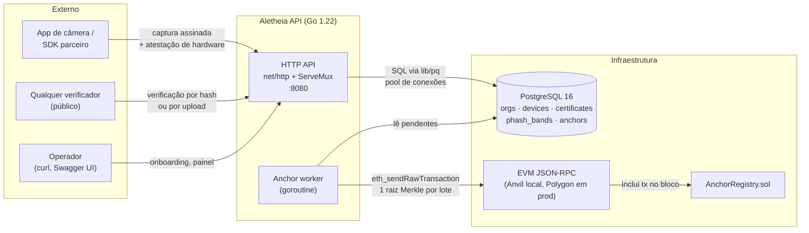
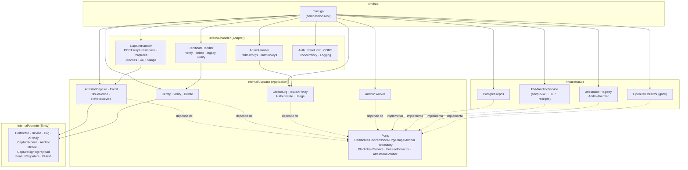
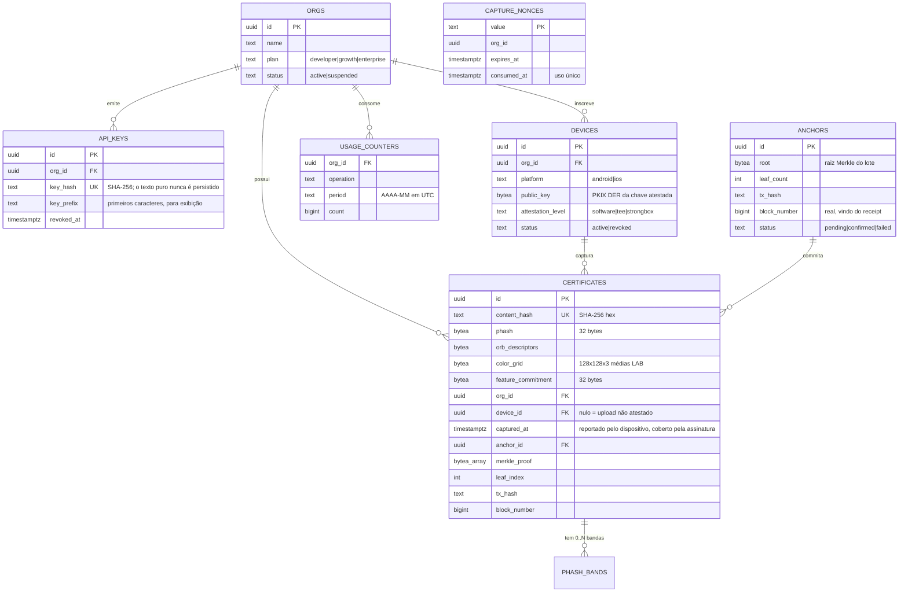
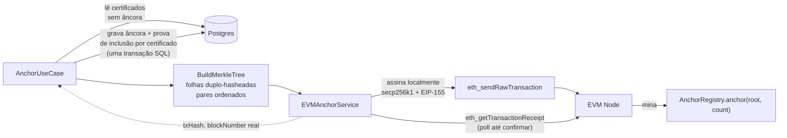
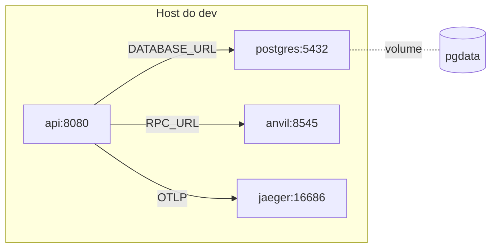

# Arquitetura

Visão estática dos componentes da Aletheia API e suas integrações. O recorte
segue Clean Architecture: as dependências apontam para dentro
(handler → usecase → domain), e a infraestrutura (Postgres, RPC EVM, OpenCV,
atestação de plataforma) fica atrás de portas declaradas em
`internal/usecase/ports.go`.

## Visão de contêineres

Duas mudanças estruturais em relação ao desenho anterior: **a certificação não
fala mais com a blockchain** (isso virou trabalho do worker, fora do caminho da
requisição), e **a certificação é fechada** — só chega ao `CertifyUseCase` uma
captura cuja assinatura de dispositivo já foi conferida.

## Visão de componentes

O pacote `internal/attestation` implementa a porta
`usecase.AttestationVerifier` devolvendo tipos de `domain`
(`AttestationRequest` / `AttestationEvidence`), então a camada de aplicação
nunca importa infraestrutura de atestação.

## Modelo de dados

`phash_bands` materializa o prefilter LSH: cada certificado com pHash gera N
tuplas `(band_idx, band_value)`, e a verificação faz `UNNEST` das bandas das
rotações candidatas antes do recheque Hamming exato de 256 bits.

Nenhuma imagem é armazenada em lugar nenhum — só a grade de cores e os
descritores ORB, que bastam ao matcher.

## Integração com a blockchain

Pontos que valem ter em mente:

- **Assinatura local.** `eth_sendTransaction` exigia uma conta destravada no
  nó, o que funciona no Anvil e em nenhum provedor RPC hospedado. Agora a
  transação é montada e assinada no processo (RLP + secp256k1, EIP-155) e
  transmitida já assinada.
- **`block_number` é real.** O serviço faz poll do receipt antes de gravar o
  lote, então o número de bloco registrado sempre corresponde a uma inclusão de
  fato. Antes era gravado `0` para todo certificado.
- **Uma transação por lote.** O custo de uma âncora não muda com a quantidade
  de certificados sob ela. Cada certificado guarda `leaf_index` e
  `merkle_proof`, e a verificação on-chain roda pela `MerkleProof` da
  OpenZeppelin.
- **Falha deixa o lote pendente.** Se a transação não confirma, nada é gravado
  e o próximo ciclo tenta de novo. Reancorar custa uma transação a mais;
  marcar certificados como ancorados numa raiz que nunca entrou distribuiria
  provas de nada.

## Deploy local (docker-compose.yml)

