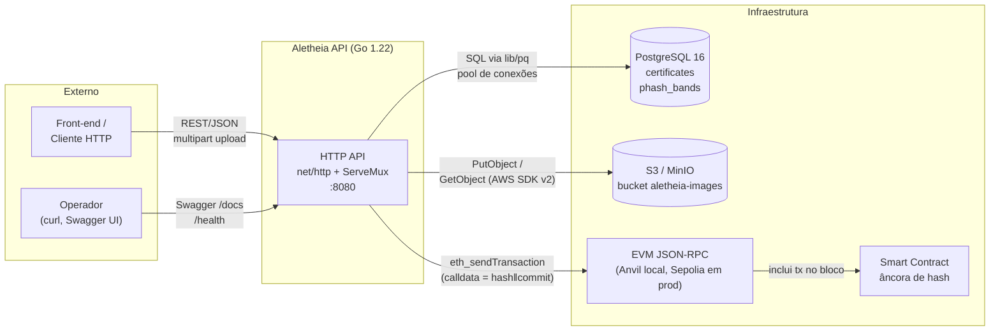
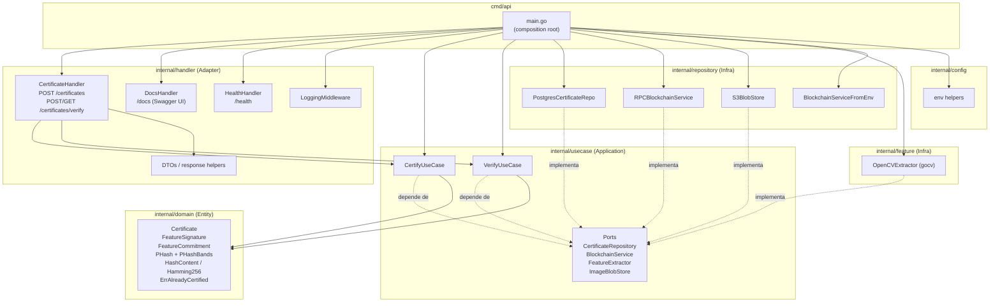
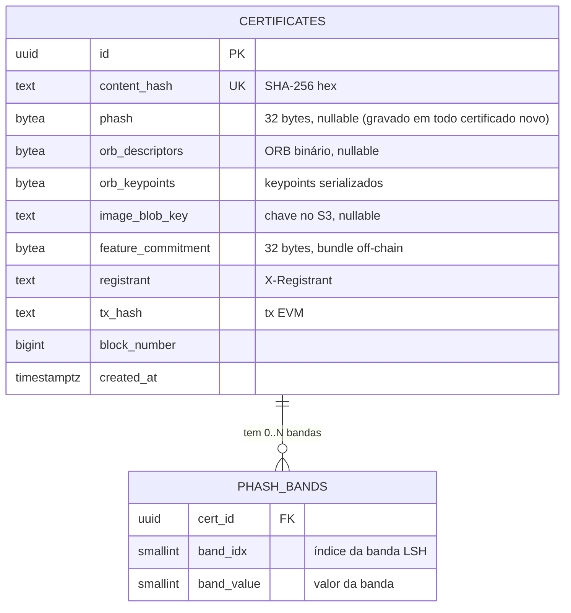
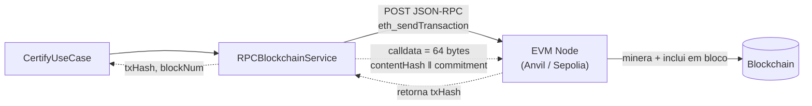
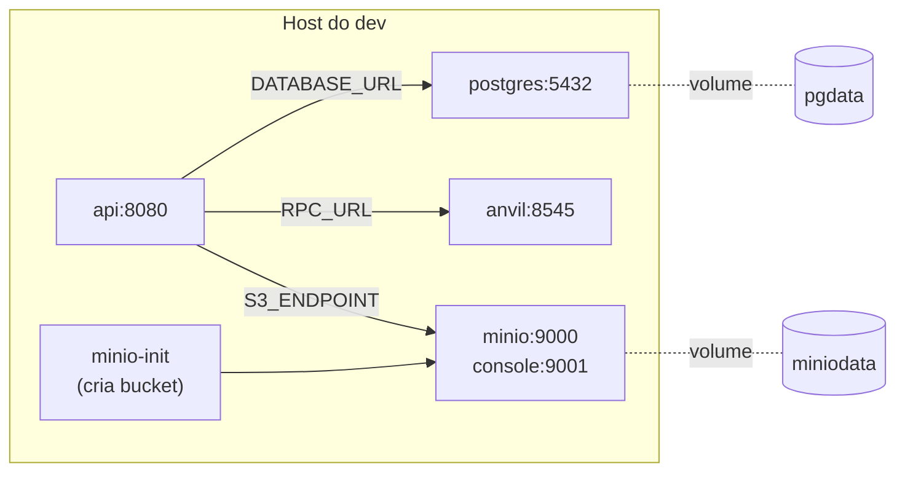

# Arquitetura

Visão estática dos componentes da Aletheia API e suas integrações. O
recorte segue Clean Architecture: as dependências apontam para dentro
(handler → usecase → domain), e a infraestrutura (Postgres, S3, RPC
EVM, OpenCV) fica atrás de portas declaradas em
`internal/usecase/ports.go`.

## Visão de contêineres

## Visão de componentes

Regra de dependência (Clean Architecture):
`handler → usecase → domain`, com `repository` e `feature`
implementando as portas declaradas em `usecase`. O único ponto que
conhece todas as camadas é `cmd/api/main.go`, onde a injeção é
cabeada.

## Modelo de dados

`phash_bands` materializa o prefilter LSH. Cada certificado com pHash
gera N tuplas `(band_idx, band_value)`. A verificação faz `UNNEST`
das bandas das rotações candidatas, une por `(band_idx, band_value)` e
reduz o universo antes do re-check Hamming exato de 256 bits.

## Integração com a blockchain

Pontos atuais que valem ter em mente:

- O serviço não chama função ABI. Envia calldata bruta para o endereço
  em `CONTRACT_ADDRESS`. O contrato lê a calldata direto do bloco como
  prova de existência.
- `block_number` ainda é gravado como `0`. A resposta de
  `eth_sendTransaction` só devolve `txHash`; recuperar o bloco real
  exige `eth_getTransactionReceipt` adicional.
- `IsHashRegistered` é stub (`return false, nil`). Hoje a única fonte
  de verdade consultada é o Postgres.

## Deploy local (docker-compose.yml)

