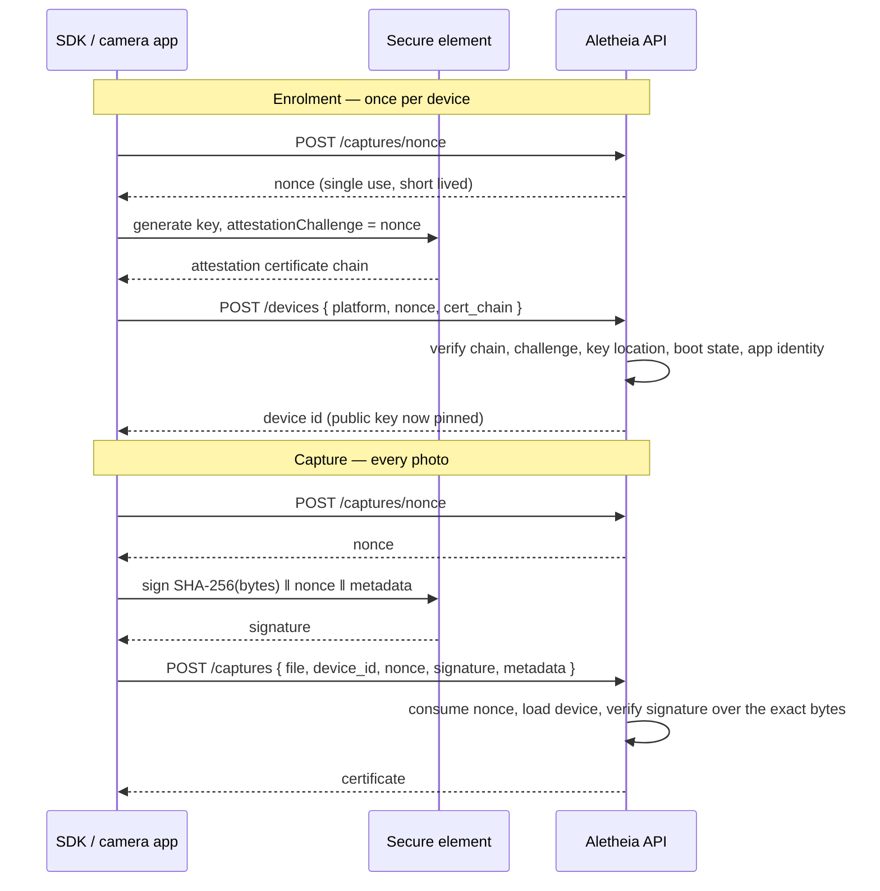

# Attested capture

This is the trust boundary of the product. Everything downstream — the
certificate, the anchor, the provenance claim shown to a verifier — inherits its
meaning from the checks described here. A capture whose attestation does not
verify never becomes a certificate.

## Why capture-time attestation

An open registry proves registration, not origin: anyone can upload a generated
image and receive a certificate for it. Gating certification behind a device
that proves its key lives in secure hardware changes the claim from "somebody
registered this" to "this device's sensor produced these exact bytes".

That is the same model C2PA uses for hardware-backed capture. The difference is
what happens afterwards: an embedded manifest is stripped by the first social
upload, whereas the perceptual index here re-finds the certificate from the
pixels. Attested capture and tolerant verification are two halves of one
system, and they have deliberately opposite requirements — one byte-exact, one
fuzzy.

## Protocol



Attestation is verified once, at enrolment, rather than on every capture: the
chain is large and its verification expensive, and once the key is pinned a
capture signature proves the same thing far more cheaply.

## What the Android verifier enforces

Every check has its own rejection reason, so an integrator debugging an SDK can
see exactly which gate they failed.

| Check | Why it exists |
|---|---|
| Chain reaches a configured Google hardware root | Without a pinned root a self-signed chain verifies and the whole check is decorative |
| `attestationChallenge` equals the issued nonce | Otherwise a chain harvested from another server, or an old one, replays |
| Security level is TEE or StrongBox | A software key can be extracted from a compromised device and used to sign anything |
| `origin` is `KM_ORIGIN_GENERATED` | An imported key existed outside the secure element at some point, which defeats the purpose |
| Bootloader locked, verified boot state `Verified` | An unlocked device can hook the app process and feed the SDK whatever it likes |
| Package name on the allowlist | Otherwise any app on any genuine device could mint captures against your registry |
| APK signing digest on the allowlist | A package name alone is trivially spoofed by a repackaged app |

`ANDROID_MIN_ATTESTATION_LEVEL` raises the bar to StrongBox.
`ANDROID_REQUIRE_VERIFIED_BOOT=false` relaxes the boot check for lab devices —
only ever on an isolated registry.

The attestation extension is parsed by walking raw DER rather than through
struct tags, because it mixes `ENUMERATED`, implicitly tagged `SET`s and
explicitly tagged constructed types in ways `encoding/asn1`'s struct tags cannot
express, and its shape drifts between attestation versions. A hostile client
controls every byte of that extension, so the parser is tested against 24
malformed-DER cases in addition to the policy cases.

## The signed payload

The device signs a length-prefixed, domain-separated byte string:

```
"aletheia-capture-v1"
uint32(len) || contentHash   lowercase hex sha256 of the image bytes
uint32(len) || nonce         hex challenge issued by the server
uint32(len) || capturedAt    RFC 3339 nanoseconds, UTC
uint32(len) || model
uint32(len) || osVersion
uint32(len) || appVersion
```

Two properties matter and both are tested:

**Domain separation.** The `aletheia-capture-v1` prefix means a signature this
key produces in some other protocol can never be replayed as a capture.

**Unambiguous framing.** Fields are length-prefixed rather than joined by a
separator. With a separator, a model name containing that separator would let
two different captures produce identical bytes to sign.

The SDK must produce this byte string exactly. It is deliberately trivial to
reimplement in Kotlin and Swift, and nothing verifies if it drifts.

**The bytes signed must be the bytes uploaded.** If the app re-encodes after
signing — a resize, a quality change, a metadata strip — every certificate
breaks. Certification is byte-exact by design; the tolerance lives entirely on
the verification side.

## Deliberate choices worth knowing

**The nonce is consumed before the signature is checked.** A failed signature
still burns the challenge. Otherwise an attacker could hold one challenge open
and grind signatures against it. The cost is that a genuine client with a
transient bug must fetch a new nonce, which is cheap.

**Nonce failures are indistinguishable.** Unknown, expired and already-spent
all return the same error, so a response cannot be used to probe the nonce
space. The same applies to API-key failures.

**Revocation is forward-only.** A revoked device stops capturing, but its
existing certificates stay in the registry, flagged rather than deleted. They
are the record of what a now-distrusted device produced — exactly what an
investigation needs. Deleting them would destroy the evidence.

**Consumption is atomic in the database.** The nonce is spent by an `UPDATE …
WHERE consumed_at IS NULL AND expires_at > now` rather than a read-then-write,
because two concurrent captures presenting the same nonce would both pass a
separate existence check.

## Known limits

**Rephotography.** An attested camera pointed at a screen showing a generated
image produces a hardware-signed certificate for a fake. Nobody has solved
this. Mitigations — moiré and refresh-banding detection, flash specular
response, depth sensing — are an arms race, and none of them are implemented
here. Say so publicly; a claim that survives scrutiny is worth more than one
that does not.

**Camera injection.** Virtual camera drivers and Frida hooks on rooted devices
are a mature commercial toolkit already used against KYC liveness systems. This
is why the key must stay in the TEE and never in the app's process, and why the
verified-boot check is on by default. It raises cost; it does not eliminate the
attack.

**Trust is transitive.** A trusted device can capture a staged or misleading
scene. The system's value in that case is that it names exactly which
organisation and which device vouched, and when.

**iOS is not implemented.** App Attest lands with the iOS SDK. Until then an
iOS enrolment is refused as an unsupported platform rather than accepted on a
weaker check.
