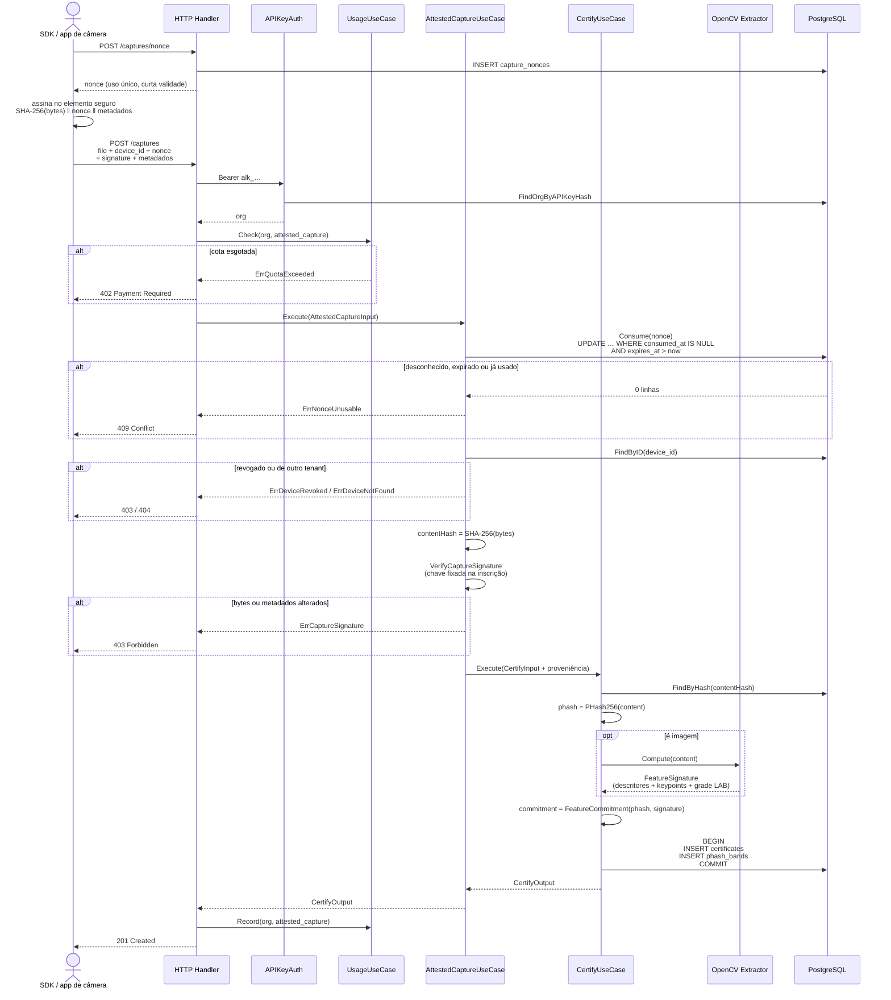
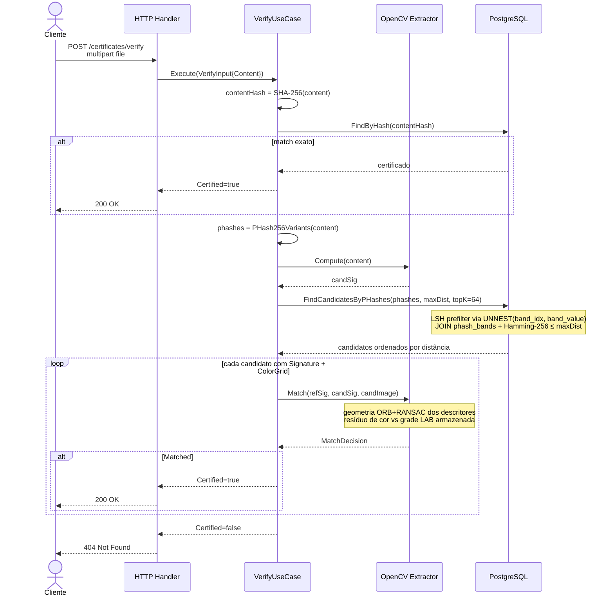
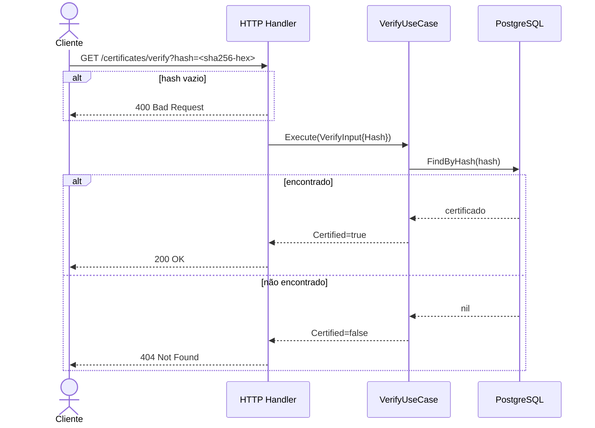

# Diagramas de Sequência

Fluxos atuais da Aletheia API, conforme implementados em
`internal/usecase` e suas portas (`internal/usecase/ports.go`).

## Captura atestada (`POST /captures`)



Pontos relevantes:

- **O nonce é consumido antes da assinatura ser conferida.** Uma assinatura
  ruim ainda queima o desafio, senão um atacante manteria um desafio aberto e
  moeria assinaturas contra ele.
- **A cota é conferida antes e contabilizada depois.** Uma captura recusada
  nunca chega numa fatura. Perder a contagem não derruba a captura: uma
  subcontagem é problema de cobrança, uma captura falha é problema do cliente.
- **A certificação não fala com a blockchain.** O certificado já é válido e
  verificável; a ancoragem vem depois, em lote.
- Falha na extração ORB é logada mas não aborta a certificação; nesses casos o
  `featureCommitment` vira o digest determinístico do bundle vazio.

## Ancoragem em lote (worker)

```mermaid
sequenceDiagram
    participant W as AnchorUseCase
    participant DB as PostgreSQL
    participant SVC as EVMAnchorService
    participant NODE as EVM JSON-RPC

    loop a cada ANCHOR_INTERVAL
        W->>DB: PendingLeaves(limit)<br/>WHERE anchor_id IS NULL
        alt nada pendente
            DB-->>W: []
            Note over W: não gasta transação
        else há certificados
            DB-->>W: certificados
            W->>W: folhas = keccak(keccak(hash ‖ commitment))
            W->>W: BuildMerkleTree → raiz + provas

            W->>SVC: RegisterRoot(raiz, n)
            SVC->>NODE: eth_getTransactionCount / eth_gasPrice
            SVC->>SVC: assina EIP-155 (RLP + secp256k1)
            SVC->>NODE: eth_sendRawTransaction
            NODE-->>SVC: txHash
            loop até confirmar ou expirar
                SVC->>NODE: eth_getTransactionReceipt
            end
            NODE-->>SVC: blockNumber real

            alt transação não confirmou
                SVC-->>W: erro
                Note over W: lote segue pendente;<br/>o próximo ciclo tenta de novo
            else confirmada
                SVC-->>W: txHash, blockNumber
                W->>DB: BEGIN<br/>INSERT anchors<br/>UPDATE certificates (prova + índice)<br/>COMMIT
            end
        end
    end
```

## Verificação por arquivo (`POST /certificates/verify`)



## Verificação por hash (`GET /certificates/verify?hash=`)


