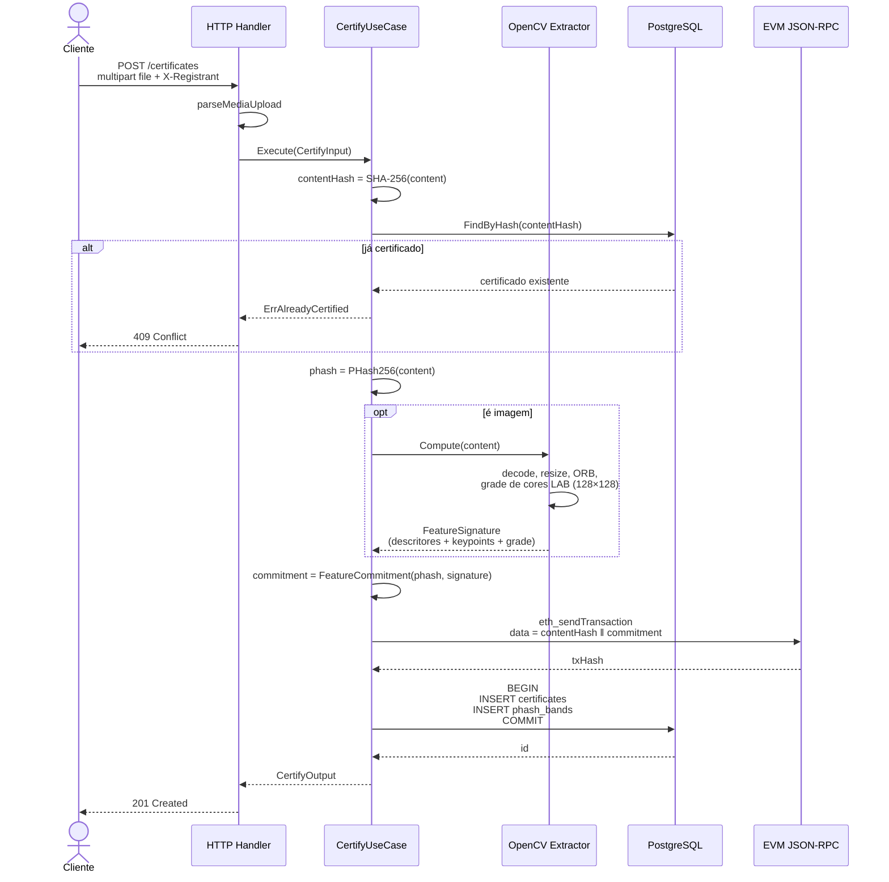
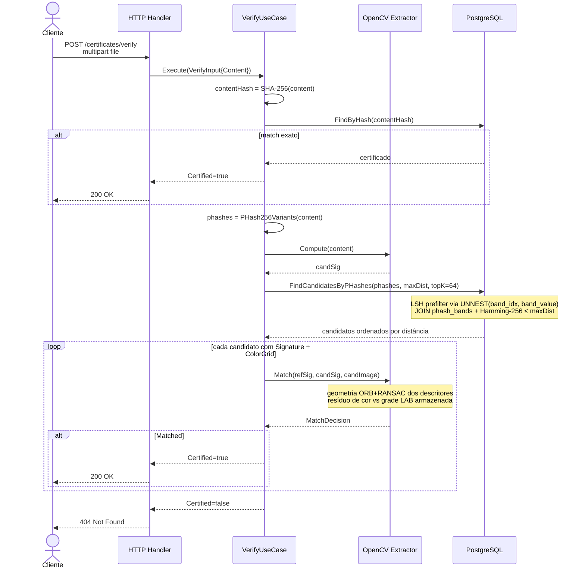
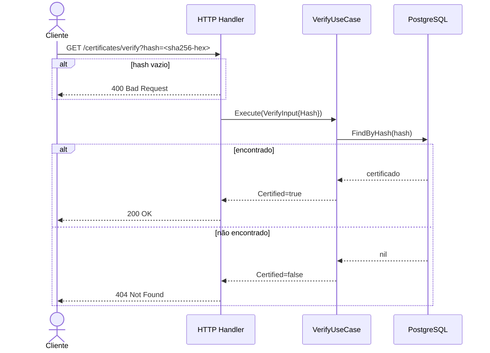

# Diagramas de Sequência

Fluxos atuais da Aletheia API, conforme implementados em
`internal/usecase` e suas portas (`internal/usecase/ports.go`).

## Certificação (`POST /certificates`)

Pontos relevantes:

- A âncora on-chain é uma única transação com 64 bytes de calldata:
  `contentHash ‖ featureCommitment`. Não há ABI; o contrato lê a
  calldata bruta do bloco.
- Falha na extração ORB é logada mas não aborta a certificação. O anchor
  on-chain é preservado mesmo sem assinatura visual; nesses casos o
  `featureCommitment` vira o digest determinístico do bundle vazio.

## Verificação por arquivo (`POST /certificates/verify`)

## Verificação por hash (`GET /certificates/verify?hash=`)

