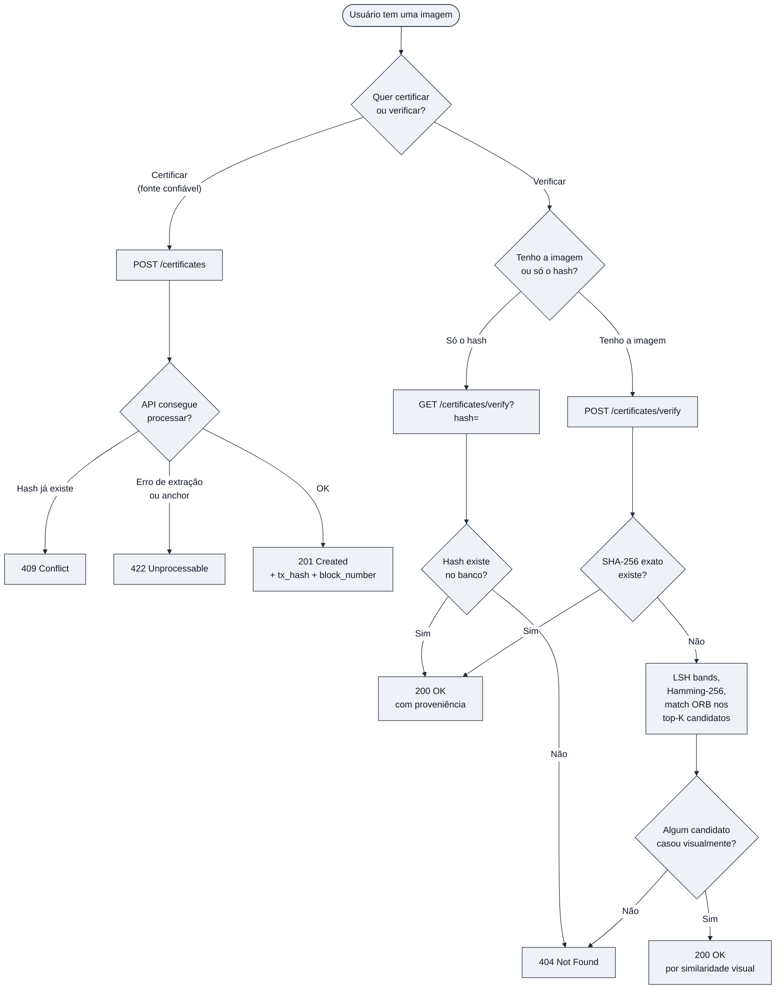
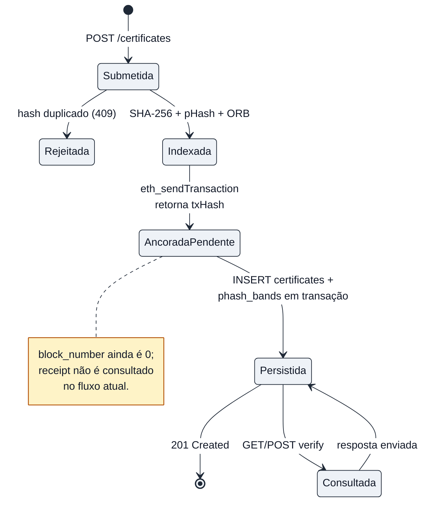
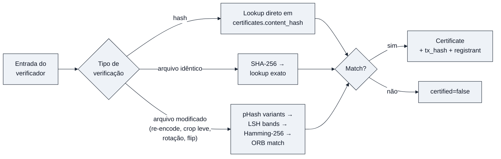

# Fluxo de Uso do Sistema

Visão orientada ao usuário. Para o detalhamento técnico, ver
[SEQUENCE_DIAGRAM.md](SEQUENCE_DIAGRAM.md) e
[ARCHITECTURE.md](ARCHITECTURE.md).

## Jornada do usuário

## Estados de um certificado

## Modos de verificação

Diferença prática entre os modos:

- Por hash e por arquivo idêntico são lookups O(1) num índice único.
- Por arquivo modificado é o caminho caro. Roda OpenCV no candidato
  (ORB + JPEG normalizado), faz prefilter LSH em `phash_bands`,
  calcula Hamming-256 contra cada sobrevivente e finalmente roda
  `Match` ORB lendo a imagem de referência do S3.

## Notas operacionais

- A certificação é idempotente. O SHA-256 é a chave única, então
  reenviar o mesmo arquivo devolve sempre 409 e o cliente não precisa
  de controle de retry.
- O custo de verificação varia muito. `GET ?hash=` é barato.
  Verificação por arquivo de imagem grande pode ser dezenas de vezes
  mais cara por causa da extração ORB e do I/O em S3 por candidato.
- A API ainda não tem autenticação. O campo `Registrant` vem do header
  `X-Registrant` e é apenas registrado, não validado. Em produção isso
  precisa ser combinado com auth real antes de servir como prova de
  proveniência.
